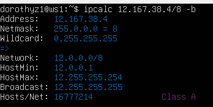
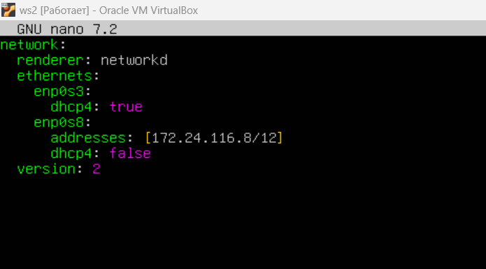
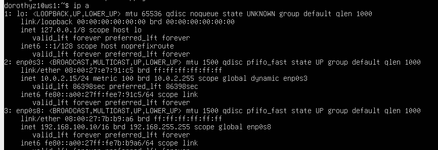
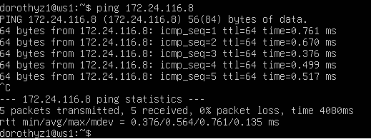
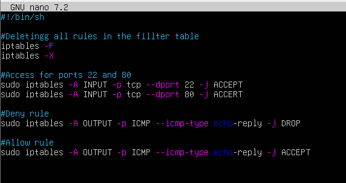
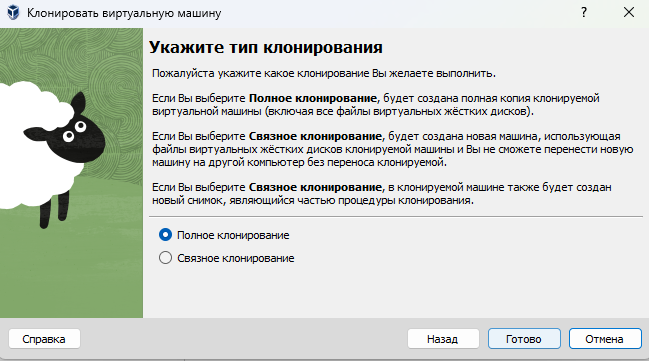

## Part 1
#### 1.1 
##### 1) Адрес сети 192.167.38.54/13
- адресс 192.160.0.0

##### 2) Перевод маски 255.255.255.0 в префиксную и двоичную запись, /15 в обычную и двоичную, 11111111.11111111.11111111.11110000 в обычную и префиксную
- 255.255.255.0 в двоичной записи: 11111111.11111111.11111111.00000000
- 255.255.255.0 в префиксной записи: /24

- /15 в обычной записи: 255.254.0.0
- /15 в двоичной записи: 11111111.11111110.00000000.00000000

- 11111111.11111111.11111111.11110000 в обычной записи: 255.255.255.240
- 11111111.11111111.11111111.11110000 в префиксной записи: /28

##### 3) Минимальный и максимальный хост в сети 12.167.38.4 при масках: /8, 11111111.11111111.00000000.00000000, 255.255.254.0 и /4

 - Минимальный хост в сети 12.167.38.4 при маске /8: 12.0.0.1
 - Максимальный хост в сети 12.167.38.4 при маске /8: 12.255.255.254

- Минимальный хост в сети 12.167.38.4 при маске /8: 12.0.0.1
- Максимальный хост в сети 12.167.38.4 при маске /8: 12.255.255.254

- Минимальный хост в сети 12.167.38.4 при маске 11111111.11111111.00000000.00000000: 12.167.0.1
- Максимальный хост в сети 12.167.38.4 при маске 11111111.11111111.00000000.00000000: 12.167.255.254

- Минимальный хост в сети 12.167.38.4 при маске 255.255.254.0: 12.167.38.1
- Максимальный хост в сети 12.167.38.4 при маске 255.255.254.0: 12.167.39.254

- Минимальный хост в сети 12.167.38.4 при маске /4: 0.0.0.1
- Максимальный хост в сети 12.167.38.4 при маске /4: 15.255.255.254

#### 1.2. localhost
##### Определи и запиши в отчёт, можно ли обратиться к приложению, работающему на localhost, со следующими IP: *194.34.23.100*, *127.0.0.2*, *127.1.0.1*, *128.0.0.1*
- localhost, обычно ассоциируется с IP-адресом 127.0.0.1. Это loopback-адрес, который обычно указывает на текущий компьютер.
- Приложения на localhost доступны только на локальной машине и не могут быть доступны через публичные IP-адреса.
- IP-адреса 127.1.0.1, 127.0.0.2 являются частью диапазона адресов 127.0.0.0/8, зарезервированных для использования в качестве адресов обратной петли (loopback). Адреса в этом диапазоне используются для тестирования сетевых соединений на локальной машине. Они не могут быть маршрутизированы через сеть и доступны только на локальной машине.
- IP-адреса 128.0.0.1, 194.34.23.100 не является loopback-адресом, и при попытке обращения к нему будет пытаться установить соединение с другим узлом в локальной сети, а не с localhost.

#### 1.3. Диапазоны и сегменты сетей
##### Определи и запиши в отчёт:
##### 1) Какие из перечисленных IP можно использовать в качестве публичного, а какие только в качестве частных: *10.0.0.45*, *134.43.0.2*, *192.168.4.2*, *172.20.250.4*, *172.0.2.1*, *192.172.0.1*, *172.68.0.2*, *172.16.255.255*, *10.10.10.10*, *192.169.168.1*
- ``Следующие диапазоны определены IANA как адреса, выделенные локальным сетям IPv4: 10.0.0.0 — 10.255.255.255 (маска подсети для бесклассовой (CIDR) адресации: 255.0.0.0 или /8) 100.64.0.0 — 100.127.255.255 (маска подсети 255.192.0.0 или /10) — Данная подсеть рекомендована согласно RFC 6598 для использования в качестве адресов для CGN (Carrier-Grade NAT). 172.16.0.0 — 172.31.255.255 (маска подсети: 255.240.0.0 или /12) 192.168.0.0 — 192.168.255.255 (маска подсети: 255.255.0.0 или /16) Также для петлевых интерфейсов (не используется для обмена между узлами сети) зарезервирован диапазон 127.0.0.0 — 127.255.255.255 (маска подсети: 255.0.0.0 или /8).``
- Выделены локальным сетям (частные): 10.0.0.45, 192.168.4.2, 172.20.250.4, 172.16.255.255, 10.10.10.10
- Не выделены локальным сетям (публичные): 134.43.0.2, 172.0.2.1, 192.172.0.1, 172.68.0.2, 192.169.168.1
##### 2) Какие из перечисленных IP адресов шлюза возможны у сети *10.10.0.0/18*: *10.0.0.1*, *10.10.0.2*, *10.10.10.10*, *10.10.100.1*, *10.10.1.255*
- ``Address: 10.10.0.0 (00001010.00001010.00 000000.00000000)`` 
``Netmask: 255.255.192.0 (11111111.11111111.11 000000.00000000)`` 
``HostMin: 10.10.0.1 (00001010.00001010.00 000000.00000001)`` 
``HostMax: 10.10.63.254 (00001010.00001010.00 111111.11111110)``
- Возможны: 10.10.0.2, 10.10.10.10, 10.10.1.255
- Невозможны: 10.0.0.1, 10.10.100.1

## Part 2

ws 1

ws 2

Опиши сетевой интерфейс, соответствующий внутренней сети, на обеих машинах и задать следующие адреса и маски: ws1 - 192.168.100.10, маска /16, ws2 - 172.24.116.8, маска /12.

- измененный файл ws1

- измененный файл ws2

- ws1 после установки маски

- ws2 после установки маски

#### 2.1. Добавление статического маршрута вручную
##### Добавь статический маршрут от одной машины до другой и обратно при помощи команды вида `ip r add`.
##### Пропингуй соединение между машинами.
- Добавление статического маршрута и пинг с ws1 на ws2  

- Добавление статического маршрута и пинг с ws2 на ws1 

#### 2.2. Добавление статического маршрута с сохранением
##### Добавь статический маршрут от одной машины до другой с помощью файла *etc/netplan/00-installer-config.yaml*.

- Измененный файл *etc/netplan/00-installer-config.yaml* ws1:  

- Измененный файл *etc/netplan/00-installer-config.yaml* ws2:  

##### Пропингуй соединение между машинами.
- ``sudo netplan appply`` на 2 машинах
- Пинг ws2 с ws1:  

- Пинг ws1 с ws2:  

## Part 3. Утилита **iperf3**
#### 3.1. Скорость соединения
##### Переведи и запиши в отчёт: 8 Mbps в MB/s, 100 MB/s в Kbps, 1 Gbps в Mbps.
- Mbps - мегабит в секунду,  MB/s - мегабайт в секунду. Мегабит — это единица измерения информации, которая равна 1 миллиону бит (бит - наименьшая единица данных). Мегабайт — это единица измерения информации, которая равна 1 миллиону байт. Байт представляет собой последовательность из 8 бит. Соотношения МБ и Мбит вычисляется через равенство: 1 МБ = 8 Мбит. Соответственно `8 Mbps = 1 MB/s`.
- 1 Кбит = 1024 бит, 1 МБ = 8388608 бит. В 1 МБ 8192 килобит. Соответсвенное `100 MB/s = 819200 Kbps`
- `1 Gbps = 1024 Mbps`

#### 3.2. Утилита **iperf3**
##### Измерь скорость соединения между ws1 и ws2.
- `sudo iperf3 -s -p 5202`. Эта команда запускает iperf3 в режиме сервера (server mode) на хосте ws2 с портом `5202`. Сервер iperf3 ожидает подключений клиентов для измерения скорости передачи данных.  

- `sudo iperf3 -c 172.24.116.8`. Эта команда запускает iperf3 в режиме клиента (client mode) на хосте ws1 и указывает на адрес IP (172.24.116.8) сервера и порт `5202`, который мы только что запустили на ws2. iperf3 на ws1 подключится к серверу на ws2 и начнет измерять скорость передачи данных между ними.  

#### 4.1. Утилита **iptables**
##### Создай файл */etc/firewall.sh*, имитирующий фаерволл, на ws1 и ws2:
##### Нужно добавить в файл подряд следующие правила:
##### 1) На ws1 примени стратегию, когда в начале пишется запрещающее правило, а в конце пишется разрешающее правило (это касается пунктов 4 и 5).
##### 2) На ws2 примени стратегию, когда в начале пишется разрешающее правило, а в конце пишется запрещающее правило (это касается пунктов 4 и 5).
##### 3) Открой на машинах доступ для порта 22 (ssh) и порта 80 (http).
##### 4) Запрети *echo reply* (машина не должна «пинговаться», т.е. должна быть блокировка на OUTPUT).
##### 5) Разреши *echo reply* (машина должна «пинговаться»).
- ws1 

- ws2  

##### Запусти файлы на обеих машинах командами `chmod +x /etc/firewall.sh` и `/etc/firewall.sh`.
- Запуск на ws1:  

- Запуск на ws2:  

- Разница в подходе:на ws1 сначала запрещающее правило, а потом разрешающее, на ws2 наоборот. Если сначала стоит запрещающее правило, то оно имеет приоритет перед последующим разрешающим.
#### 4.2. Утилита **nmap**
##### Командой **ping** найди машину, которая не «пингуется», после чего утилитой **nmap** покажи, что хост машины запущен.
- Проверка пинга ws2 с ws1  

- пинг c ws2 на ws1, он не получился, порт запущен что видно по команде `nmap`  

`-` Пока что мы соединяли всего две машины, но теперь пришло время для статической маршрутизации целой сети.

## Part 5. Статическая маршрутизация сети

`-` Пока что мы соединяли всего две машины, но теперь пришло время для статической маршрутизации целой сети.

**== Задание ==**

Сеть: \

- для ускорения процесса склонируем машины:  

укажем создание нового MAC-адреса 

- Сетевые адаптеры на ws11:

- Сетевые адаптеры на ws21:

- Сетевые адаптеры на ws22:

- Сетевые адаптеры на r1:

- Сетевые адаптеры на r2:

#### 5.1. Настройка адресов машин
##### Настрой конфигурации машин в *etc/netplan/00-installer-config.yaml* согласно сети на рисунке.
- ws11: 

- ws21 

- ws22 

- r1  

- r2  

##### Перезапусти сервис сети. Если ошибок нет, то командой `ip -4 a` проверь, что адрес машины задан верно. Также пропингуй ws22 с ws21. Аналогично пропингуй r1 с ws11.
- ws21: 

- ws22: 

- r1: 

- r1: 

- пинг  ws22 c ws 21: 

- пинг r1 с ws11 

#### 5.2. Включение переадресации IP-адресов
##### Для включения переадресации IP, выполни команду на роутерах:
`sysctl -w net.ipv4.ip_forward=1`
*При таком подходе переадресация не будет работать после перезагрузки системы.*
-r1  

-r2  

##### Открой файл */etc/sysctl.conf* и добавь в него следующую строку:
`net.ipv4.ip_forward = 1`
*При использовании этого подхода, IP-переадресация включена на постоянной основе.*
- r1  

- r2  

#### 5.3. Установка маршрута по-умолчанию
##### Настрой маршрут по-умолчанию (шлюз) для рабочих станций. Для этого добавь `default` перед IP роутера в файле конфигураций.
- ws11:  
- ws21:  
- ws22:    
- ` Таким образом, пинг с ws11 доходит до r2, но так как роутеру неизвестно, куда возвращать пакеты, они не возвращаются назад `

##### Вызови `ip r` и покажи, что добавился маршрут в таблицу маршрутизации.
- ws11:  
- ws21:  
- ws22:  
##### Пропингуй с ws11 роутер r2 и покажи на r2, что пинг доходит.
- пинг с ws11 роутер r2 :  
- на r2 доходит:  

#### 5.4. Добавление статических маршрутов
##### Добавь в роутеры r1 и r2 статические маршруты в файле конфигураций.
- r1:    
Это означает, что все пакеты, адресованные сети 10.20.0.0, будут отправляться через указанный шлюз (10.100.0.12 - eth0 r2)
- r2:   
Это означает, что все пакеты, адресованные сети 10.10.0.0, будут отправляться через указанный шлюз (10.100.0.11 - eth1 r1)
##### Вызови `ip r` и покажи таблицы с маршрутами на обоих роутерах. Пример таблицы на r1:
- r1:  
- r2:  
##### Запусти команды на ws11:
- 
- Для адреса 10.10.0.0/18 был выбран маршрут, отличный от 0.0.0.0/0, потому что маска /18 описывает маршрут к сети точнее, в отличие от маски /0. Маршрут по умолчанию default имеет самый низкий приоритет из всех возможных. Он применяется при выборе маршрута в случае соответствия ip назначения сразу нескольким сетевым интерфейсам таблицы маршрутизации, либо при его несоответствии ни одному из других правил в таблице маршрутизации.

#### 5.5. Построение списка маршрутизаторов
##### Запусти на r1 команду дампа:
`tcpdump -tnv -i eth0`
##### При помощи утилиты **traceroute** построй список маршрутизаторов на пути от ws11 до ws21.
- tcpdump:  
- traceroute:  
- Команда traceroute в Linux определяет маршрут и измеряет задержки между вашим компьютером и удаленным хостом, отправляя пакеты данных с увеличивающимся TTL и записывая ответы от промежуточных маршрутизаторов..

#### 5.6. Использование протокола **ICMP** при маршрутизации
##### Запусти на r1 перехват сетевого трафика, проходящего через eth0 с помощью команды:
`tcpdump -n -i eth0 icmp`
- r1:  
##### Пропингуй с ws11 несуществующий IP (например, *10.30.0.111*) с помощью команды:
`ping -c 1 10.30.0.111`
- ws11:  
- Пакеты, отправителенные на 10.30.0.111, проходят через путь по-умолчанию через роутер r1

## Part 6. Динамическая настройка IP с помощью **DHCP**

`-` Следующим нашим шагом будет более подробное знакомство со службой **DHCP**, которую ты уже знаешь.

**== Задание ==**

*В данном задании используются виртуальные машины из Части 5.*

##### Для r2 настрой в файле */etc/dhcp/dhcpd.conf* конфигурацию службы **DHCP**:
##### 1) Укажи адрес маршрутизатора по-умолчанию, DNS-сервер и адрес внутренней сети. Пример файла для r2:
- r2:  
##### 2) В файле *resolv.conf* пропиши `nameserver 8.8.8.8`.
- r2:  
##### Перезагрузи службу **DHCP** командой `systemctl restart isc-dhcp-server`. Машину ws21 перезагрузи при помощи `reboot` и через `ip a` покажи, что она получила адрес. Также пропингуй ws22 с ws21.
- Проверка статуса сервера на r2:  
- Так как в сети теперь есть dhcp, то в конфигурации *etc/netplan/00-installer-config.yaml* у ws22 и ws21, находящихся в сети 10.20.0.0/26 прописываем dhcp4: true   
- 
- Видим, что после перезагрузки ws21 получил динамический ip  
- Пинг ws22 с ws21:   
##### Укажи MAC адрес у ws11, для этого в *etc/netplan/00-installer-config.yaml* надо добавить строки: `macaddress: 10:10:10:10:10:BA`, `dhcp4: true`.
- Указываем MAC адрес в конфигурации:   
##### Для r1 настрой аналогично r2, но сделай выдачу адресов с жесткой привязкой к MAC-адресу (ws11). Проведи аналогичные тесты.
- Настройка в */etc/dhcp/dhcpd.conf* конфигурации службы **DHCP** на r1   
- Настройка файла *resolv.conf*, а именно добавление `nameserver 8.8.8.8`   
- Проверка статуса сервера на r1:   
- Видим, что после перезагрузки ws11 (уже с новым MAC адресом) получил динамический ip 
##### Запроси с ws21 обновление ip адреса.
- (-r означает освободить IP-адрес)   
- 
- В отчёте помести скрины ip до и после обновления.
- ДО:   
- ПОСЛЕ:   
- Опции **DHCP** сервера:  1. `sudo dhclient -r enp0s8` : Эта команда освобождает IP-адрес, полученный через интерфейс enp0s8. Опция -r указывает на освобождение адреса.  2. `sudo dhclient` : Эта команда запускает процесс получения сетевых параметров от DHCP сервера для всех доступных сетевых интерфейсов. Если IP-адрес был ранее освобожден командой dhclient -r, эта команда запросит новый адрес у DHCP сервера и обновит другие сетевые параметры согласно ответу сервера.
`-` Ну и в конце в качестве вишенки на торте я расскажу тебе про механизм преобразования адресов.

## Part 7. **NAT**
##### В файле */etc/apache2/ports.conf* на ws22 и r1 измени строку `Listen 80` на `Listen 0.0.0.0:80`, то есть сделай сервер Apache2 общедоступным.
- r1:   
- ws22:   
##### Запусти веб-сервер Apache командой `service apache2 start` на ws22 и r1.
- r1:    
- ws22:   
##### Добавь в фаервол, созданный по аналогии с фаерволом из Части 4, на r2 следующие правила:
##### 1) Удаление правил в таблице filter - `iptables -F`;
##### 2) Удаление правил в таблице "NAT" - `iptables -F -t nat`;
##### 3) Отбрасывать все маршрутизируемые пакеты - `iptables --policy FORWARD DROP`.
- Фаервол:  
##### Запусти файл также, как в Части 4.
- Запуск:  
##### Проверь соединение между ws22 и r1 командой `ping`.
*При запуске файла с этими правилами, ws22 не должна «пинговаться» с r1.*
- 
- 
##### Добавь в файл ещё одно правило:
##### 4) Разрешить маршрутизацию всех пакетов протокола **ICMP**.
- Фаервол:  
##### Запусти файл также, как в Части 4.
-  Запуск:   
- Проверка правил:  
##### Проверь соединение между ws22 и r1 командой `ping`.
*При запуске файла с этими правилами, ws22 должна «пинговаться» с r1.*
- 
- 

##### Добавь в файл ещё два правила:
##### 5) Включи **SNAT**, а именно маскирование всех локальных ip из локальной сети, находящейся за r2 (по обозначениям из Части 5 - сеть 10.20.0.0).
##### 6) Включи **DNAT** на 8080 порт машины r2 и добавить к веб-серверу Apache, запущенному на ws22, доступ извне сети.
- `sudo iptables -A FORWARD -m state --state ESTABLISHED -j ACCEPT`   
-A: Добавляет новое правило в таблицу правил FORWARD. Таблица FORWARD используется для управления трафиком, предназначенным для других узлов и проходящем через этот узел. 
-m state: Использовать модуль состояния для проверки состояния пакетов 
--state ESTABLISHED: Проверить, находится ли пакет в состоянии ESTABLISHED. Состояние ESTABLISHED указывает, что входящий пакет принадлежит существующему и установленному соединению. 
-j ACCEPT: Указывает, что пакеты, соответствующие условиям правила, должны быть приняты и разрешены проходить через межсетевой экран.
- `sudo iptables -A FORWARD -p tcp --dport 80 -j ACCEPT`  
-p tcp: Указывает, что правило применяется к пакетам протокола TCP.  
--dport 80: Указывает, что правило применяется к пакетам, направляемым на TCP-порт 80. Порт 80 обычно используется для веб-трафика HTTP. 
- `sudo iptables -t nat -A POSTROUTING -o enp0s8 -s 10.20.0.0/26 -j SNAT --to-source 10.100.0.12`  
-t nat: Указывает на использование таблицы NAT (Network Address Translation), которая используется для изменения IP-адресов пакетов. 
-A POSTROUTING: Добавляет новое правило в цепочку POSTROUTING. POSTROUTING используется для изменения исходящего трафика после того, как пакеты были маршрутизированы, но перед тем, как они покинут систему. 
-o enp0s8: Применяет правило к пакетам, исходящим через интерфейс enp0s8. 
-s 10.20.0.0/26: Определяет диапазон исходных IP-адресов, к которым применяется правило. В данном случае, это подсеть 10.20.0.0 с маской 255.255.255.192. 
-j SNAT: Указывает, что правило будет выполнять операцию SNAT (преобразование исходного сетевого адреса). 
--to-source 10.100.0.12: Задает новый исходный IP-адрес для пакетов, соответствующих правилу. Все пакеты, исходящие из подсети 10.20.0.0/26 через интерфейс enp0s8, будут иметь исходный IP-адрес изменен на 10.100.0.12.
- `sudo iptables -t nat -A PREROUTING -i enp0s8 -p tcp --dport 8080 -j DNAT --to-destination 10.20.0.20:80`
-A PREROUTING: Добавляет новое правило в цепочку PREROUTING. PREROUTING используется для изменения входящего трафика до того, как пакеты будут маршрутизированы в системе. 
--dport 8080: Определяет порт назначения, к которому применяется правило. В данном случае, это порт 8080. 
-j DNAT: Указывает на целевое действие, которое следует выполнить для пакетов, соответствующих критериям правила. В данном случае, это изменение адреса назначения пакета (DNAT). 
--to-destination 10.20.0.20:80: Задает новый адрес назначения для пакетов, соответствующих правилу. Все пакеты, входящие на порт 8080 через интерфейс enp0s8, будут перенаправлены на адрес 10.20.0.20 порт 80.
- 
- Описание: 
##### Запусти файл также, как в Части 4.
-  Запуск:   
##### Проверь соединение по TCP для **SNAT**: для этого с ws22 подключиться к серверу Apache на r1 командой:
`telnet [адрес] [порт]`
-  Запуск:   
##### Проверь соединение по TCP для **DNAT**: для этого с r1 подключиться к серверу Apache на ws22 командой `telnet` (обращаться по адресу r2 и порту 8080).
-  Запуск:   

## Part 8. Дополнительно. Знакомство с **SSH Tunnels**
SSH - The Secure Shell protocol
##### Запусти на r2 фаервол с правилами из Части 7.
- 
##### Запусти веб-сервер **Apache** на ws22 только на localhost (то есть в файле */etc/apache2/ports.conf* измени строку `Listen 80` на `Listen localhost:80`).
- 
- 
##### Воспользуйся *Local TCP forwarding* с ws21 до ws22, чтобы получить доступ к веб-серверу на ws22 с ws21.
- 
- 
##### Воспользуйся *Remote TCP forwarding* c ws11 до ws22, чтобы получить доступ к веб-серверу на ws22 с ws11.
- 
- 
- `sudo iptables -A FORWARD -p tcp -m multiport 22,80,8080 -j ACCEPT` 
- Pазрешает входящий TCP-трафик на портах 22, 80 и 8080  
-m multiport 22,80,8080  Список портов, к которым применяется правило. В данном случае, это порты 22 (SSH), 80 (HTTP) и 8080 (часто используется для веб-серверов и веб-приложений).
- 
- 
##### Для проверки, сработало ли подключение в обоих предыдущих пунктах, перейди во второй терминал (например, клавишами Alt + F2) и выполни команду:
`telnet 127.0.0.1 [локальный порт]` (tcp port telnet - 23)
- В отчёте опиши команды, необходимые для выполнения этих четырёх пунктов, а также приложи скриншоты с их вызовом и выводом.
- Команда `ssh -R 8080:localhost:80 10.20.0.20` используется для создания обратного туннеля с помощью SSH  
-R: Этот флаг используется для создания обратного туннеля. Обратный туннель позволяет перенаправлять трафик с удаленного сервера на локальную машину.  
8080:localhost:80: Этот параметр указывает, что порт 8080 на удаленном сервере (в данном случае, 10.20.0.20) будет перенаправлен на порт 80 на локальной машине. Это означает, что любой трафик, отправленный на порт 8080 удаленного сервера, будет перенаправлен на порт 80 локальной машины. 
10.20.0.20: Это IP-адрес удаленного сервера, к которому подключаюсь.
